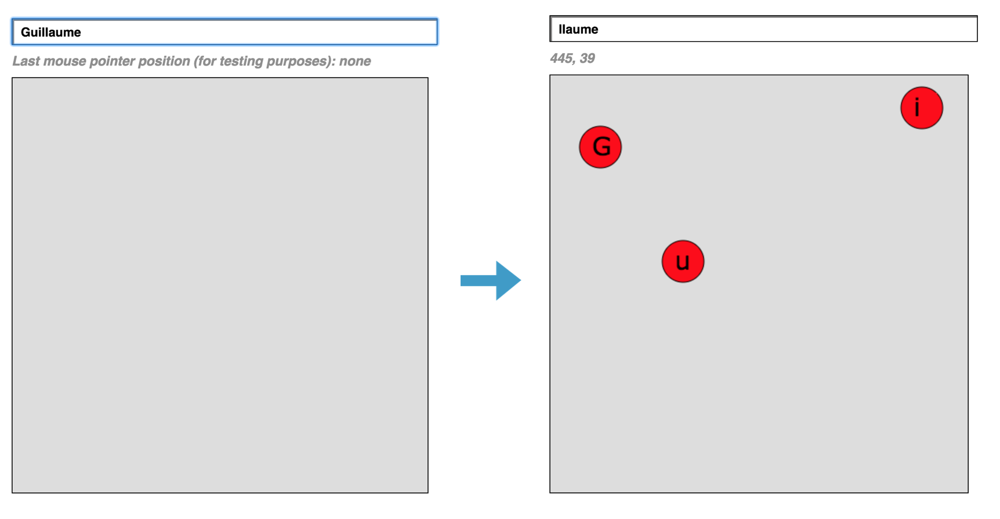
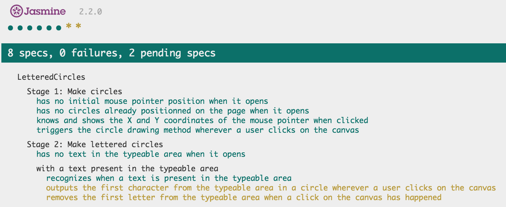

:abc: Lettered Circles :abc:
===
Stage 1: Make circles

When the user clicks on the page, a circle appears under the mouse cursor (and persists statically in that position). 

Stage 2: Make lettered circles

1. Some typeable area is added to the page
2. Each time a user clicks somewhere, it delete the first letter from the typeable area and display it within the newly created circle.

Technologies used
----
- Javascript
- Jasmine
- JQuery
- HTML & CSS

How to run it
----
```
git clone git@github.com:GBouffard/lettered_circles.git
cd lettered_circles
npm install
npm start
```
By opening your browser on http://localhost:3000, you can now you can play with lettered circles.
Here is a screenshot of what the app looks like:



How to run tests
----
```
cd lettered_circles
open SpecRunner.html
```

and this is what you should see:



What I learnt
----
- The HTML <canvas> element is used to draw graphics on a web page. I used it for the first time.
- Drawing shapes on a page (circles) was also a first time. Discovering how all of these work (also with the x & y positioning) was really interesting.
- new functionalities from Javascript that I had never come across yet and that I used for the application to work.

What to improve
----
- canvas testing was a first time for me and I have bypassed the tests that I still have issues with the time to find solutions. Maybe I need to experiment with spies and HTML DOM EventListeners, which I never used. Any suggestion or advice from any reader is more than welcome.